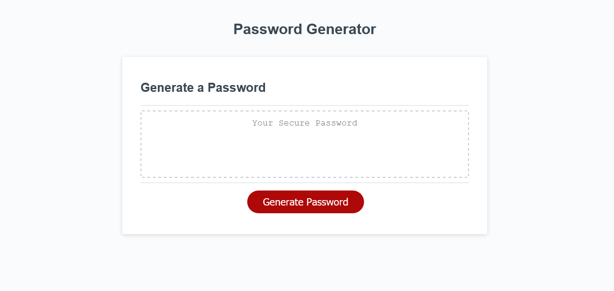

# Homework assignment 3

JavaScript homework assignment for third unit, creating a password generator in the browser. This assignment asked for a password generator that includes (or excludes) different fields. Aforementioned fields included symbols, numbers, lower case letters and capital letters.

# My Experience

This required a lot of rethinking and I had initially overcomplicated the project very intensely. I wanted to use the numerical values assigned to each symbol in the browser but that ended up seeming problematic across browsers.

# Description of Comments and Subsequent Code

The script starts off with declaring the variables under the generate button at the top, which was part of the code the previous dev had added in. Next was creating the function to write the password with the selected password options. The password generated is the specified length and will only include the characters that were previously specified.

